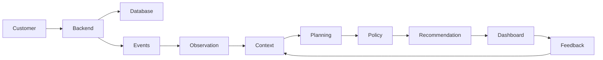

# SBI Compass

SBI Compass is an intelligent, event-driven digital banking recommendation platform. It aims to make digital banking contextual and engaging by understanding customer activity, history, and stated goals, and providing personalized financial guidance at the right moments.

Additionally, SBI Compass serves as a policy navigator for bank staff, helping them quickly parse through extensive internal banking circulars and guidelines using AI.

---

## 🚀 Key Features

*   **Goal Management:** Allow customers to define, track, and optimize their financial goals (e.g., buying a home, saving for education, retirement planning).
*   **Contextual Recommendation Engine:** Event-driven recommendations triggered by real-time customer actions, transactions, and historical behavior.
*   **AI Policy Navigator:** RAG-powered query interface for bank staff to search internal policies and guidelines.
*   **Feedback Integration:** Active feedback loop where user actions (clicks, dismissals, ratings) continuously refine the recommendation algorithms.
*   **Comprehensive Dashboards:** Tailored interfaces for customers (dashboard, recommendations history) and employees (policy search console).

---

## 📐 Architecture Diagram

SBI Compass follows an event-driven flow to ingest activities, compute signals, retrieve historical context, plan recommendations, apply bank policy validation rules, and capture feedback to close the loop.



*For more detailed architecture notes, please refer to the [docs/architecture.md](docs/architecture.md) file.*

---

## 🛠️ Tech Stack

### Frontend
*   **Next.js** (App Router, React)
*   **TypeScript**
*   **Tailwind CSS** (for styling)

### Backend
*   **Go** (Gin Web Framework)
*   **PostgreSQL** (Transactional and user database)
*   **Redis** (Fast caching and event queueing)

### AI Service
*   **Python** (FastAPI)
*   **LLM Integration** (RAG pipeline for policy circulars and planning state)

---

## 📂 Folder Structure

```
sbi-compass/
├── README.md
├── LICENSE
├── .gitignore
├── docs/
│   ├── architecture.md
│   ├── problem-statement.md
│   └── diagrams/
│       └── architecture.png (optional)
├── frontend/
│   └── README.md
├── backend/
│   └── README.md
├── ai-service/
│   └── README.md
```

---

## 💻 Setup Instructions (WIP)

> [!NOTE]
> This project is currently in the initial scaffolding and architectural design phase. Full local setup commands will be finalized as components are built.

### Prerequisites
*   Node.js (v18+) & npm (for Frontend)
*   Go (v1.20+) (for Backend)
*   Python (v3.10+) (for AI Service)
*   Docker & Docker Compose (to spin up PostgreSQL and Redis instances)

### Step 1: Clone the Repository
```bash
git clone https://github.com/GhanshyamJha05/SBI-Compass.git
cd SBI-Compass
```

### Step 2: Running Components
Refer to individual README files in each subdirectory:
*   [Frontend Setup](frontend/README.md)
*   [Backend Setup](backend/README.md)
*   [AI Service Setup](ai-service/README.md)

---

## 🗺️ Roadmap

- [x] Define project scope
- [x] Complete architecture
- [ ] Build backend services
- [ ] Implement event processing
- [ ] Add planning engine
- [ ] Build frontend dashboard
- [ ] Integrate recommendation workflow
- [ ] Deploy prototype
