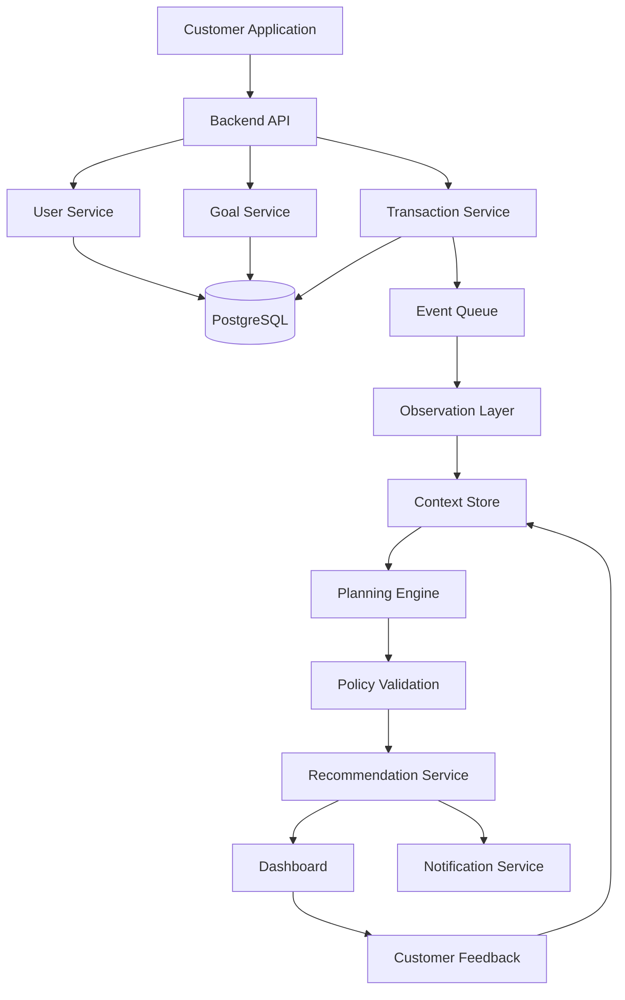
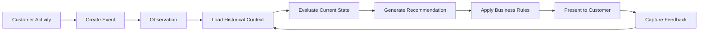
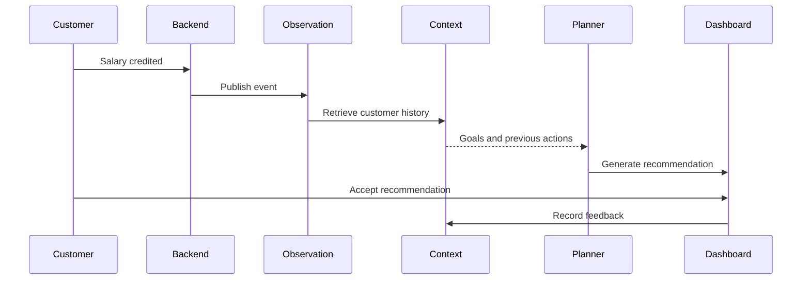
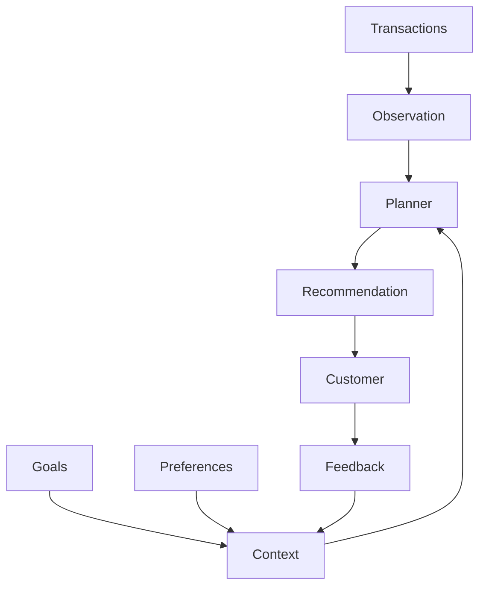
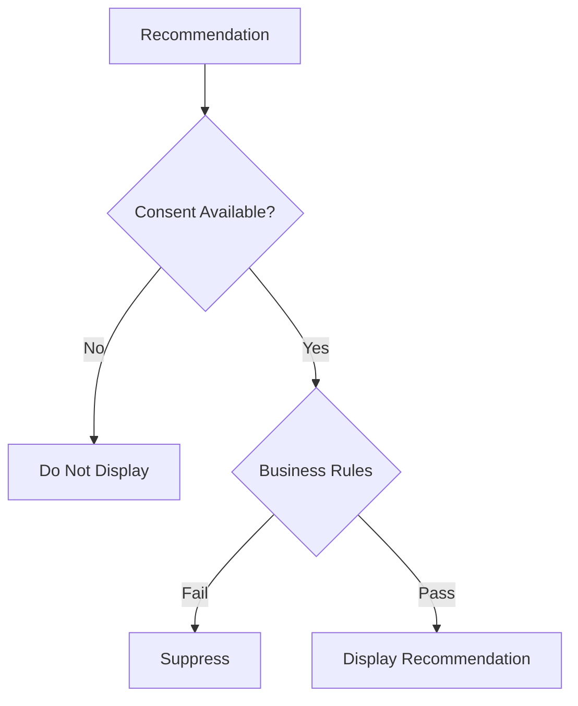

# SBI Compass

## Overview

SBI Compass is a customer journey intelligence platform designed for digital banking. It processes customer events, maintains historical context, and generates timely recommendations based on user goals and account activity.

The system follows an event-driven architecture where every meaningful interaction is evaluated against existing context before a recommendation is presented. Recommendations are explainable, traceable, and subject to business rules before reaching the customer.

---

# Architecture



---

# Request Lifecycle



---

# Components

### Observation Layer

Receives application events and converts them into structured signals such as:

* Salary credited
* Recurring payment detected
* Goal updated
* Spending category changed
* Unusual transaction pattern

### Context Store

Maintains long-term information including:

* Financial goals
* Previous recommendations
* Customer preferences
* Historical feedback

### Planning Engine

Evaluates the current event together with historical context and determines the next recommended action.

### Policy Validation

Ensures recommendations satisfy internal business constraints before delivery.

### Recommendation Service

Publishes approved recommendations to customer-facing channels such as dashboards or notifications.

---

# Example Flow



---

# Context Management



---

# Governance



---

# Technology Stack

| Layer          | Implementation      |
| -------------- | ------------------- |
| Frontend       | Next.js, TypeScript |
| Backend        | Go (Gin)            |
| Data Store     | PostgreSQL          |
| Cache          | Redis               |
| AI Service     | Python (FastAPI)    |
| Vector Storage | pgvector            |
| Authentication | JWT                 |
| Deployment     | Docker              |

---

# Repository Structure

```text
sbi-compass/
├── frontend/
├── backend/
├── ai-service/
├── docs/
├── infrastructure/
├── docker-compose.yml
└── README.md
```

---

# Development Roadmap

* Initial project setup
* Event ingestion pipeline
* Context storage
* Recommendation engine
* Customer dashboard
* Administrative reporting
* Deployment pipeline

---

# Notes

* Customer consent is required before generating personalized recommendations.
* Feedback from previous interactions influences future recommendations.
* Recommendations are evaluated against policy rules before presentation.
* The platform is designed to support incremental feature additions without changing the overall architecture.
