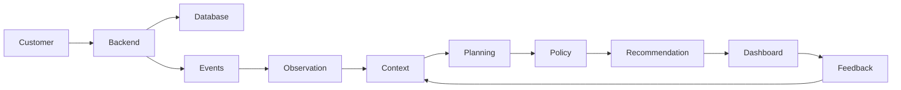

# Architecture

## High-Level Design

SBI Compass follows an event-driven architecture where customer actions generate events that are processed asynchronously.



## Components

### Backend API
Handles authentication, transactions, and customer goals.

### Observation Layer
Converts raw events into structured signals.

### Context Store
Maintains goals, previous recommendations, and feedback.

### Planning Engine
Evaluates customer context and generates recommendations.

### Policy Validation
Applies business rules before recommendations are surfaced.

### Dashboard
Displays approved recommendations and captures customer feedback.

## Event Flow

```
Customer Activity
→ Event Processing
→ Context Retrieval
→ Planning
→ Policy Validation
→ Recommendation
→ Feedback
→ Context Update
```
